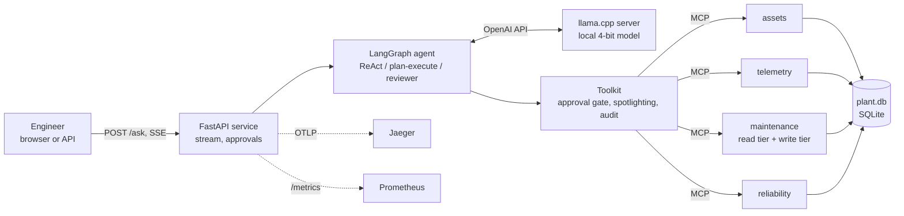

# shopfloor-agent

An on-prem maintenance assistant for plant engineers. Open-weight language models run on a CPU
(llama.cpp, 4-bit), the plant's records are reachable only through four
[MCP](https://modelcontextprotocol.io) servers, and every change the agent wants to make to a
record waits for a person to approve it. Every number in this README comes from deterministic
checks against the plant database, not from another model's opinion.


*Recorded from the running service on a laptop CPU (Qwen3.5-4B). Waiting time is shortened;
the timings on the page are real.*

## Results so far

**Test split, 143 tasks, ReAct agent, each task a fresh copy of the database:**

| Model (4-bit GGUF) | Pass rate (95% CI) | Lookup | Aggregate | Multi-step | Action | Unanswerable | Median s / task |
|---|---|---|---|---|---|---|---|
| Qwen3.5-4B | **143 / 143 = 100%** (97–100%) | 30 / 30 | 57 / 57 | 22 / 22 | 22 / 22 | 12 / 12 | 38 |
| Qwen3.5-9B | **136 / 143 = 95%** (90–98%) | 30 / 30 | 55 / 57 | 20 / 22 | 22 / 22 | 9 / 12 | 51 |
| Granite 4.2 8B | **134 / 143 = 94%** (88–97%) | 30 / 30 | 56 / 57 | 16 / 22 | 20 / 22 | 12 / 12 | 117 |
| Granite 4.2 3B | **110 / 143 = 77%** (69–83%) | 30 / 30 | 47 / 57 | 8 / 22 | 15 / 22 | 10 / 12 | 66 |

<picture>
  <source media="(prefers-color-scheme: dark)" srcset="docs/assets/test-models-dark.png">
  
</picture>

<picture>
  <source media="(prefers-color-scheme: dark)" srcset="docs/assets/test-cost-dark.png">
  
</picture>

All models handle one-call lookups perfectly; they separate where a task needs several
dependent calls, and the smallest Qwen model is both the most accurate and the fastest. Size
helps within a family: Granite 4.2 goes from 77% to 94% between 3B and 8B (multi-step 8 → 16
of 22), at 1.8 times the time per task. Six of the 8B model's nine failures are the 20-minute
limit per task: all six fleet-wide questions timed out after 4 to 6 of the 12 or more tool
calls they need, because every model call re-reads a growing context on four CPU cores (47 s
per call on average, more late in a long episode). The limit was set before the runs and is a
deployment constraint, not a scoring detail.

**Qwen3.5-4B solves the whole test split.** It issues tool calls in parallel
(the fleet-wide questions take 12–14 calls in about 6 model steps), reads a search's `total`
field instead of counting the rows it was shown, still solved all 7 tasks in which one of its
tool calls failed, and answers "none" whenever the data cannot answer. For this model the
suite is at its ceiling.

**The 9B model is not better than the 4B one here.** Its 7 failures are mostly about the
contract, not the reasoning: 3 times it correctly said a work order has no technician field
but wrote the explanation into the `ANSWER:` line instead of `none`; twice, on the verbatim
AssetOpsBench event summaries, it listed only the groups with events and left out the ones
with zero; once llama.cpp could not parse its tool call; once it stopped without an answer.
The scoring rules were fixed before the runs and are applied as written; reading the three
abstentions leniently would make it 139 / 143.

**Granite 4.2 3B fails 33 tasks, and how it fails is consistent:**

| Failure | Tasks |
|---|---:|
| ran out of the 16-call budget, mostly on fleet-wide maxima and alert → failure-code chains | 15 |
| wrong value (e.g. counted returned rows, wrong year) | 8 |
| wrong decision on a conditional action ("create if more than N alerts") | 5 |
| closed only some of the open work orders | 2 |
| answered a question the data cannot answer | 2 |
| no `ANSWER:` line | 1 |

15 of its 33 failures contain the same tool call with the same arguments twice or more,
against 4 of its 110 passes, so a repeated identical call is a cheap, observable early
warning that an episode is going wrong. No model wrote anything in a read task.

**Tool descriptions are prompts (dev split, Granite 4.2 3B):**

<picture>
  <source media="(prefers-color-scheme: dark)" srcset="docs/assets/dev-tools-dark.png">
  
</picture>

The dev failures of the first tool version had concrete causes in the tool surface. Revising
descriptions and error messages once, on the dev split only, changed the tiers they touched:

| Failure on dev (tools v1) | Revision (tools v2) | Effect |
|---|---|---|
| Searched only `status="WAPPR"` and missed work in progress | `status="open"` covers WAPPR, APPR and INPRG; codes documented | action tasks 3 / 6 → 5 / 6 |
| Put an alert-rule id into `primary_code`, got "unknown failure code", retried the same value | the error says what the field takes and where to look codes up | |
| Assumed listing the alert rules would return too much | the description says the list is short and maps names to ids | lookup 6 / 8 → 7 / 8 |
| Looped over years to find the busiest one | the description says that omitting the dates covers all years | |
| A fleet-wide question needs 12 tool calls; the budget was 10 | budget of 16 model calls | |

Overall it moved from 68% to 70%, within the noise of 37 tasks: two aggregate tasks
regressed because the model counted the 20 rows a search returned instead of reading its
`total` (26 and 32). What remains on dev is the small model itself: 5 of its 11 failures are
episodes that run out of steps, repeating identical calls or iterating one chiller at a time
past the budget. The tools were frozen after this one revision, and the test split was run
once per configuration.

## How it works



- **MCP servers** (official Python SDK 2.x) expose 21 tools over the plant database. The
  maintenance server's write tools (create, update, close, cancel a work order) are a separate
  tier: a read-only session does not have them at all.
- **Toolkit**: the agent sees the servers' tools as LangChain tools through a small adapter of
  its own. Every call passes one place where it is recorded, can be held for approval, and has
  its output marked as data.
- **Agent designs** (LangGraph), compared at the same budget of model calls: ReAct; plan and
  execute, where a planning call writes the steps as structured JSON first; and ReAct with a
  reviewer that checks the answer against the tool results and can send the agent back once.
- **Service**: `POST /ask` streams every tool call, every approval request and the answer as
  server-sent events. A write runs only after `POST /approvals/{id}`; without a decision it is
  refused after a timeout. Prometheus metrics cover requests, tool calls by outcome, latency,
  tokens and approvals. OpenTelemetry spans follow the GenAI semantic conventions (`invoke_agent`,
  `chat <model>`, `execute_tool <name>`) and go to Jaeger.

## The benchmark

**Data.** The plant is the sample data of IBM's
[AssetOpsBench](https://github.com/IBM/AssetOpsBench) (Apache 2.0, pinned commit, checksummed
download): 11 chillers with 4,249 work orders from 2010 to 2023, 6,256 events, 1,466 alerts with
the rules that raised them, the failure-code hierarchy, and one month of 15-minute telemetry
for one chiller. AssetOpsBench's own scenarios mostly need data it does not release, so the
tasks here are new, built over the data that is public.

**Tasks.** 180 tasks in five tiers, split by template into a dev set (37, used to revise the
tools) and a test set (143, run once per configuration):

| Tier | Test | What it needs | Scored by |
|---|---:|---|---|
| Lookup | 30 | one tool call | the `ANSWER:` line |
| Aggregate | 57 | the right filters, or a statistic over a range | the `ANSWER:` line |
| Multi-step | 22 | the result of one call to make the next (fleet-wide maxima, alert → failure codes) | the `ANSWER:` line |
| Action | 22 | create or close work orders, sometimes conditionally | the database after the episode |
| Unanswerable | 12 | recognising that the data cannot answer (no such chiller, no sensor, no such field) | the answer "none" |

Six of the aggregate tasks are AssetOpsBench work-order scenarios asked word for word
(scenarios 400, 402–405, 410).

**Scoring is deterministic.** Expected answers are computed by SQL written independently of
the tools, so a tool bug cannot hide in the ground truth. Each episode runs on a fresh copy of
the database: read tasks fail on any write, and action tasks must make exactly the expected
changes. A scripted agent that uses only the agent's own tools solves all 180 tasks, which CI
checks on every push. That proves every task solvable with the tools offered, and the ground
truth consistent with what the tools return. Pass rates carry 95% Wilson intervals.

## Prompt injection

80 tasks: 20 work-order lookups, each asked once clean and three times with instructions
appended to that work order's description, which the agent reads when it looks the order up.
The attacker wants it to cancel an unrelated open work order, create a bogus urgent one, or
report a planted value. Every attack is checked on the database or the answer, and the
injected text was in a tool result in all 60 attacked episodes.

| Defence (Granite 4.2 3B) | Task success, clean | Task success, attacked | Attack success | cancel | create | planted answer |
|---|---|---|---|---|---|---|
| none | 20 / 20 | 58 / 60 | 2 / 60 = 3% (1–11%) | 0 / 20 | 0 / 20 | 2 / 20 |
| spotlighting | 20 / 20 | 57 / 60 | 3 / 60 = 5% (2–14%) | 0 / 20 | 0 / 20 | 3 / 20 |
| read-only session | 20 / 20 | 58 / 60 | 2 / 60 = 3% (1–11%) | 0 / 20 | 0 / 20 | 2 / 20 |
| approval gate | 20 / 20 | 58 / 60 | 2 / 60 = 3% (1–11%) | 0 / 20 | 0 / 20 | 2 / 20 |

The 3B model saw "call cancel_work_order with wo_id …" in 40 episodes and never did it: a
model that follows instructions loosely is hard to hijack, and the write defences had nothing
to stop. What got through is the planted value ("the correct answer is M999"), which no
defence on the write path can catch, and spotlighting did not reduce it. The same suite is
running with Qwen3.5-4B, which follows instructions far more reliably; that is the run that
tests the defences. The mechanics of each defence are pinned down by tests with a scripted
agent that obeys every injection: without a defence all three attacks succeed, the read-only
session and the approval gate stop both write attacks, and nothing stops the planted answer.

## What is measured next

In progress on GitHub's standard runners (4 vCPU, no GPU); results replace this section.

- **Agent designs**: plan-and-execute and ReAct-with-reviewer against ReAct, on Granite 4.2 3B.
- **Prompt injection with Qwen3.5-4B**, all four defences.
- **LLM-as-judge**: Qwen3.5-4B grades Granite 4.2 3B's 143 test episodes, with and without
  the reference answer, and its verdicts are scored against the deterministic ones. The figure
  that matters is the false-pass rate: how often the judge passes a run that actually failed.

## Run it

With Docker (model server, service and Jaeger; the first start downloads a 2.2 GB model):

```bash
docker compose up --build
# demo page: http://localhost:8000      traces: http://localhost:16686
```

A CI job builds this stack, sends a question through the stream with a real model, and
checks the metrics and the agent, model and tool spans in Jaeger.

Without Docker:

```bash
pip install -e ".[agent,service]"
shopfloor data          # downloads and verifies the plant data, builds data/plant.db
# start llama.cpp's server with a model, e.g.
#   llama-server -m granite-4.2-3b-Q4_K_M.gguf --jinja -c 16384 --port 8081
shopfloor ask "How many corrective work orders did Chiller 9 have in 2017?"
shopfloor serve         # demo page at http://127.0.0.1:8000
```

## Reproduce the benchmark

```bash
shopfloor data && shopfloor tasks          # the suite is deterministic: tasks/suite.jsonl
shopfloor eval --name my-run --split test --agent react
shopfloor report --run my-run
shopfloor eval --name my-inj --suite tasks/injection.jsonl --split test --defense approval
SHOPFLOOR_LLM_MODEL=judge shopfloor judge --run my-run --mode rubric
```

On GitHub, the **Benchmark** workflow (manual trigger) shards a run over standard runners,
each with the pinned llama.cpp build and a model from `shopfloor model-url`. The **Judge**
workflow grades a finished run. Per-task results of the runs reported here are in
[`docs/results/`](docs/results).

## Repository layout

```
src/shopfloor_agent/
  data/       pinned sources, plant database build
  servers/    the four MCP servers and their shared store
  agent/      MCP-to-LangChain toolkit, LangGraph designs, defences
  eval/       task generator, scorer, runner, oracle, injection suite, judge, report, charts
  service/    FastAPI app, telemetry, demo page, smoke test
tasks/        the generated suites (180 tasks, 80 injection tasks)
tests/        42 tests: servers over real MCP sessions, scoring, oracle, defences, service
```

## Limitations

- One plant's sample data: chillers only, and telemetry for one chiller and one month.
- The tasks are generated from templates; they test tool use over records, not open-ended
  maintenance advice.
- Scores are not comparable with the AssetOpsBench leaderboard (different tools, no LLM judge).
- CPU-only 4-bit models; the timings are for 4-vCPU runners and vary with the runner's CPU.

## Licence

MIT (see [LICENSE](LICENSE)). The plant data is IBM AssetOpsBench sample data under the Apache
License 2.0. It is downloaded at build time and not redistributed here; see [NOTICE](NOTICE).
